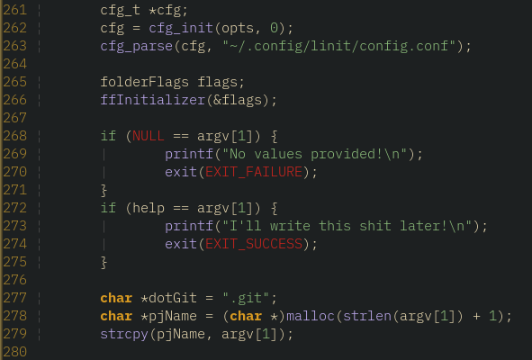

# MyEyes

the theme i was using made no logical sense and my eyes were fucking burning
so I needed a new theme.

by the WAY, I know it works when you install with VimPlug, IDK about anything else AND dont forget to 

    set termguicolors
    colorscheme myeyes

[Based off of a custom VimColors theme that I tweaked.](https://vimcolors.org/)

## Screenshots

C code

Go code 

Java code

